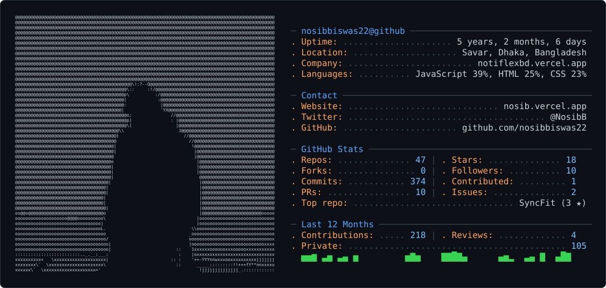

<picture>
  <source media="(prefers-color-scheme: dark)" srcset="dark_mode.svg" />
  <source media="(prefers-color-scheme: light)" srcset="light_mode.svg" />
  
</picture>

<h3 align="center">⚡ Core Tech Stack</h3>

  

<h3 align="center">⚡ GitHub Stats</h2>

  
  

 

  

 

  
  
  

